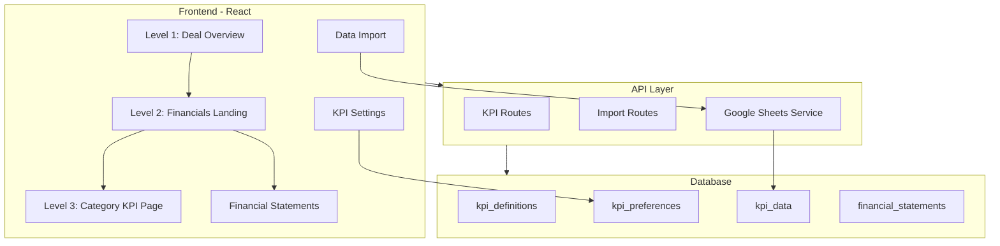
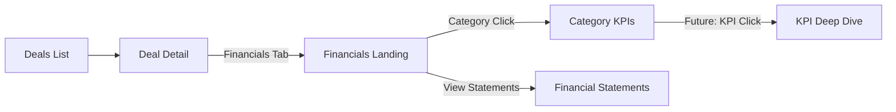

# KPI Dashboard System Implementation Plan

## System Architecture



---

## Phase 1: Database Schema

Create new migration `022_kpi_system.sql` with:

### Core Tables

**1. `kpi_definitions`** - Master list of all available KPIs| Column | Type | Description |

|--------|------|-------------|

| id | UUID | Primary key |

| code | TEXT | Unique identifier (e.g., `noi`, `cap_rate`) |

| name | TEXT | Display name |

| category | TEXT | Category bucket (rent_revenue, occupancy, etc.) |

| description | TEXT | Explanation of the KPI |

| format | TEXT | Display format (currency, percentage, number) |

| formula | TEXT | Optional calculation formula |

| sort_order | INT | Display order within category |**2. `kpi_preferences`** - User/fund customization| Column | Type | Description |

|--------|------|-------------|

| id | UUID | Primary key |

| fund_id | UUID | FK to funds |

| kpi_id | UUID | FK to kpi_definitions |

| is_featured | BOOLEAN | Show on landing page |

| is_enabled | BOOLEAN | Show in category view |

| sort_order | INT | Custom display order |**3. `kpi_data`** - Actual KPI values with time dimensions| Column | Type | Description |

|--------|------|-------------|

| id | UUID | Primary key |

| deal_id | UUID | FK to deals |

| kpi_id | UUID | FK to kpi_definitions |

| period_type | TEXT | monthly, quarterly, yearly |

| period_date | DATE | Period start date |

| data_type | TEXT | actual, forecast, budget |

| value | DECIMAL | The KPI value |

| source | TEXT | manual, google_sheets, excel |

| imported_at | TIMESTAMPTZ | When data was imported |**4. `financial_statements`** - Optional statement data| Column | Type | Description |

|--------|------|-------------|

| id | UUID | Primary key |

| deal_id | UUID | FK to deals |

| statement_type | TEXT | income, balance_sheet, cash_flow |

| period_date | DATE | Statement period |

| data | JSONB | Line items as structured JSON |**5. `data_connections`** - Google Sheets connections| Column | Type | Description |

|--------|------|-------------|

| id | UUID | Primary key |

| fund_id | UUID | FK to funds |

| provider | TEXT | google_sheets, excel |

| name | TEXT | Connection name |

| credentials_encrypted | TEXT | OAuth tokens |

| spreadsheet_id | TEXT | Google Sheet ID |

| column_mapping | JSONB | KPI to column mapping |

| last_synced_at | TIMESTAMPTZ | Last sync time |---

## Phase 2: Backend API

### New Module: `apps/api/src/modules/kpis/`

**Files to create:**

- `kpis.routes.ts` - Route definitions
- `kpis.controller.ts` - Request handlers
- `kpis.service.ts` - Business logic

**Endpoints:**| Method | Endpoint | Description |

|--------|----------|-------------|

| GET | `/kpis/definitions` | Get all KPI definitions |

| GET | `/kpis/definitions/:category` | Get KPIs by category |

| GET | `/kpis/preferences` | Get fund's KPI preferences |

| PUT | `/kpis/preferences` | Update preferences (toggle, reorder) |

| GET | `/deals/:id/kpis` | Get deal's KPI data |

| GET | `/deals/:id/kpis/:category` | Get deal KPIs by category |

| POST | `/deals/:id/kpis` | Create/update KPI data |

| GET | `/deals/:id/financials` | Get financial statements |

| POST | `/deals/:id/financials` | Save financial statement |

### New Module: `apps/api/src/modules/data-import/`

**Files to create:**

- `data-import.routes.ts`
- `data-import.controller.ts`
- `data-import.service.ts`
- `google-sheets.service.ts`

**Endpoints:**| Method | Endpoint | Description |

|--------|----------|-------------|

| GET | `/import/connections` | List data connections |

| POST | `/import/connections/google` | Connect Google Sheets |

| DELETE | `/import/connections/:id` | Remove connection |

| POST | `/import/sync/:connectionId` | Trigger manual sync |

| POST | `/import/excel` | Upload Excel file |

| GET | `/import/preview/:connectionId` | Preview mapped data |---

## Design Patterns from Testing Branch

The KPI system will adopt the exact design language from your existing dashboard:

### KPI Card Pattern (from `FundOverviewRow`)

```tsx
// Reusable KPI card structure
<div className="rounded-xl border bg-card p-4 shadow-sm hover:shadow-md transition-shadow">
  <div className="flex items-center gap-2.5 mb-2">
    <div className={`flex h-8 w-8 items-center justify-center rounded-lg ${iconBg}`}>
      {icon}
    </div>
    <span className="text-xs font-medium text-muted-foreground">{title}</span>
  </div>
  <p className="text-2xl font-bold tracking-tight mb-1">{value}</p>
  <div className="flex items-center gap-1 text-xs">
    <span className={change >= 0 ? 'text-emerald-600' : 'text-red-500'}>
      {change >= 0 ? '+' : ''}{change}%
    </span>
    <span className="text-muted-foreground">vs Last Month</span>
  </div>
</div>
```

### Color System (8 icon backgrounds)

| KPI Type | Icon Color | Background |

|----------|------------|------------|

| Revenue/AUM | emerald-600 | bg-emerald-100 |

| Committed | blue-600 | bg-blue-100 |

| Called | cyan-600 | bg-cyan-100 |

| Deployed | purple-600 | bg-purple-100 |

| Cash | green-600 | bg-green-100 |

| Debt | orange-600 | bg-orange-100 |

| ROI | indigo-600 | bg-indigo-100 |

| IRR/Rates | pink-600 | bg-pink-100 |

### Grid Layout

```tsx
// Responsive 8-column grid (matches FundOverviewRow)
<div className="grid gap-3 grid-cols-2 sm:grid-cols-4 lg:grid-cols-8">
  {kpis.map(kpi => <KpiCard key={kpi.id} {...kpi} />)}
</div>
```

### Chart Pattern (from `DealsRow`)

- Pure SVG with viewBox for responsiveness
- Gradient area fill (`linearGradient`)
- Interactive hover with tooltips
- Grid lines with `strokeDasharray="4 4"`
- Indigo color scheme (`#6366f1`)

### Card Container Pattern

```tsx
<div className="rounded-xl border bg-card p-5 shadow-sm">
  <div className="flex items-center justify-between mb-4">
    <h2 className="font-semibold">{title}</h2>
    <Link className="flex items-center gap-1 text-sm text-primary hover:underline">
      View all <ArrowRight className="h-4 w-4" />
    </Link>
  </div>
  {/* Content */}
</div>
```

---

## Phase 3: Frontend Components

### Directory Structure

```javascript
apps/web/src/features/manager-dashboard/
├── components/
│   ├── kpi/
│   │   ├── KPICard.tsx              # Individual KPI display
│   │   ├── KPIGrid.tsx              # Grid of KPI cards
│   │   ├── KPICategoryNav.tsx       # Category navigation buttons
│   │   ├── KPITimeFilter.tsx        # Time dimension filters
│   │   ├── KPIComparisonBadge.tsx   # Actual vs Budget indicator
│   │   ├── KPIChart.tsx             # Trend visualization
│   │   └── index.ts
│   ├── financials/
│   │   ├── IncomeStatement.tsx      # Income statement view
│   │   ├── BalanceSheet.tsx         # Balance sheet view
│   │   ├── CashFlowStatement.tsx    # Cash flow view
│   │   ├── StatementTable.tsx       # Shared table component
│   │   └── index.ts
│   └── import/
│       ├── GoogleSheetsConnect.tsx  # OAuth connection UI
│       ├── ColumnMapper.tsx         # Map columns to KPIs
│       ├── ExcelUploader.tsx        # Excel file upload
│       └── index.ts
└── pages/
    ├── DealFinancials.tsx           # Level 2: Landing page
    ├── DealKPICategory.tsx          # Level 3: Category view
    ├── DealFinancialStatements.tsx  # Financial statements page
    └── KPISettings.tsx              # KPI customization
```

### Key Pages

**Level 2: Financials Landing (`DealFinancials.tsx`)**Layout mirrors `ManagerDashboard.tsx` with row-based structure:

```javascript
Row 1: Featured KPIs (4-8 cards in responsive grid)
Row 2: KPI Trend Chart (full width, area chart like DealsRow)
Row 3: Category Navigation (pill buttons for each category)
Row 4: Financial Statements link (optional)
```

**Level 3: Category View (`DealKPICategory.tsx`)**Displays all KPIs in selected category with filtering:

```javascript
Header: Category name + time filter tabs (Actual | Forecast | Budget)
Row 1: Primary KPIs (large cards with trend charts)
Row 2: Secondary KPIs (standard cards grid)
Row 3: Comparison toggle (vs Budget, YoY) with delta badges
```

### Component Specifications

**`KPICard.tsx`** - Extends `KpiCard` pattern from FundOverviewRow:

- Props: `title`, `value`, `icon`, `iconBg`, `change`, `changeLabel`, `trend[]`
- Optional mini sparkline chart
- Supports comparison mode (actual vs budget)

**`KPICategoryNav.tsx`** - Category pill buttons:

- Active state with primary color
- Badge showing count of KPIs per category
- Icons per category (DollarSign, Home, Building, etc.)

**`KPITrendChart.tsx`** - SVG area chart (like DealsRow):

- Time series data with hover tooltips
- Multiple series support (actual vs forecast)
- Responsive with preserveAspectRatio

---

## Phase 4: KPI Configuration

### Real Estate KPI Categories

**Rent/Revenue**

- Gross Potential Rent (GPR)
- Effective Gross Income (EGI)
- Total Revenue
- Revenue Per Unit
- Revenue Per Sq Ft

**Occupancy**

- Physical Occupancy Rate
- Economic Occupancy Rate
- Vacancy Rate
- Lease Renewal Rate
- Average Days Vacant

**Property Performance**

- Net Operating Income (NOI)
- NOI Margin
- Operating Expense Ratio
- Cap Rate
- Cash on Cash Return

**Financial**

- Total Revenue
- Total Expenses
- EBITDA
- Free Cash Flow
- Return on Investment

**Debt Service**

- Debt Service Coverage Ratio (DSCR)
- Loan-to-Value (LTV)
- Interest Coverage Ratio
- Principal Balance
- Monthly Debt Service

---

## Phase 5: Google Sheets Integration

### OAuth Flow

1. User clicks "Connect Google Sheets" in settings
2. Redirect to Google OAuth consent screen
3. Callback stores encrypted refresh token
4. User selects spreadsheet from their Drive
5. User maps columns to KPI definitions
6. System syncs data on schedule or manual trigger

### Column Mapping UI

- Display spreadsheet columns
- Drag-and-drop to KPI fields
- Auto-detect common patterns
- Validate data types

---

## Navigation Flow



## Visual Reference

**Level 2: Financials Landing** (modeled after Fund Dashboard)

```
+------------------------------------------------------------------+
| Deal Financials                          Last updated: 07:40 AM  |
+------------------------------------------------------------------+
| [NOI]      [Cap Rate]  [Occupancy] [DSCR]    [GPR]     [EGI]    |
| $985K      6.93%       94%         1.45x     $125K     $118K    |
| +12% MoM   +5% MoM     -2% MoM     +8% MoM   +10% MoM  +9% MoM  |
+------------------------------------------------------------------+
|  Monthly Performance                                      [...]  |
|  [========== Area Chart with Trend Line =============]          |
+------------------------------------------------------------------+
| Category: [Rent/Revenue] [Occupancy] [Performance] [Debt] [All] |
+------------------------------------------------------------------+
| [View Financial Statements ->]                                   |
+------------------------------------------------------------------+
```

**Level 3: Category View** (e.g., Rent/Revenue KPIs)

```
+------------------------------------------------------------------+
| Rent/Revenue KPIs          [Actual] [Forecast] [Budget]         |
+------------------------------------------------------------------+
| [GPR]           [EGI]           [Total Revenue]    [Rev/Unit]   |
| $125,000        $118,000        $142,000           $1,183       |
| +10% vs Budget  +8% vs Budget   +12% vs Budget     +5% vs Budg  |
+------------------------------------------------------------------+
|  Revenue by Month (Actual vs Forecast)               [Compare]  |
|  [========== Dual Line Chart =============]                     |
+------------------------------------------------------------------+
| [Rev/SqFt]      [Rent Growth]    [Loss to Lease]   [Concessions]|
| $1.25           +3.2% YoY        $4,200            $2,100       |
+------------------------------------------------------------------+
```

---

## Key Files to Modify

| File | Changes |

|------|---------|

| [`apps/web/src/features/manager-dashboard/pages/DealDetail.tsx`](apps/web/src/features/manager-dashboard/pages/DealDetail.tsx) | Add "Financials" tab linking to new Level 2 page |

| [`apps/web/src/routes.tsx`](apps/web/src/routes.tsx) | Add routes for new pages |

| [`apps/api/src/routes.ts`](apps/api/src/routes.ts) | Register new API modules |

| [`packages/shared/src/types/deal.types.ts`](packages/shared/src/types/deal.types.ts) | Add KPI-related types |---

## Implementation Order

The work will proceed in this sequence:

1. Database migration with seed KPI definitions
2. Backend KPI module (CRUD for KPI data)
3. Frontend Level 2 page (Financials Landing)
4. Frontend Level 3 page (Category View)
5. KPI preferences/customization
6. Financial statements (optional view)
7. Google Sheets integration